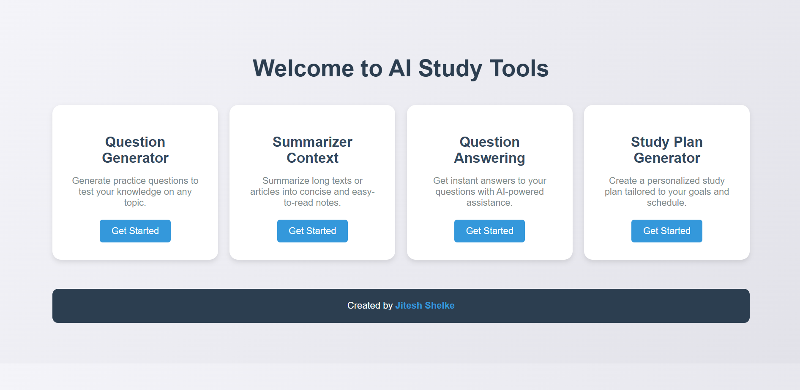
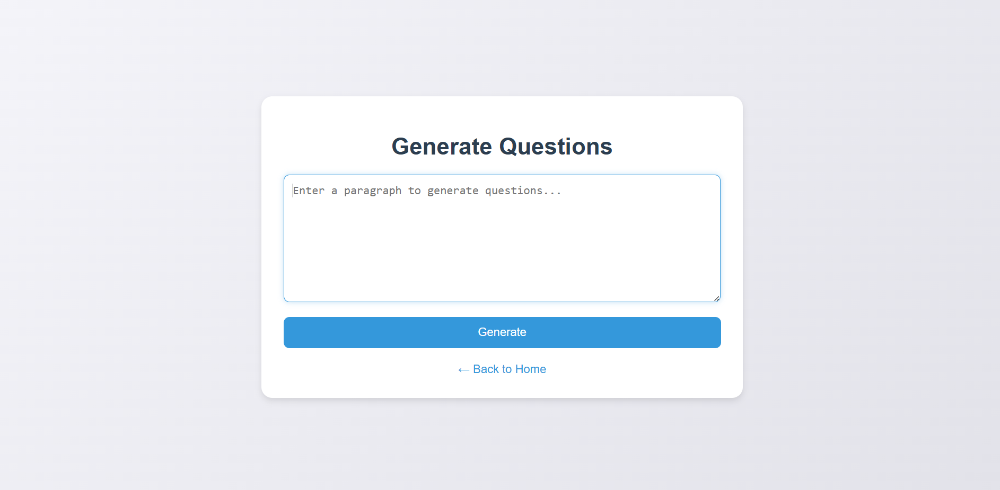
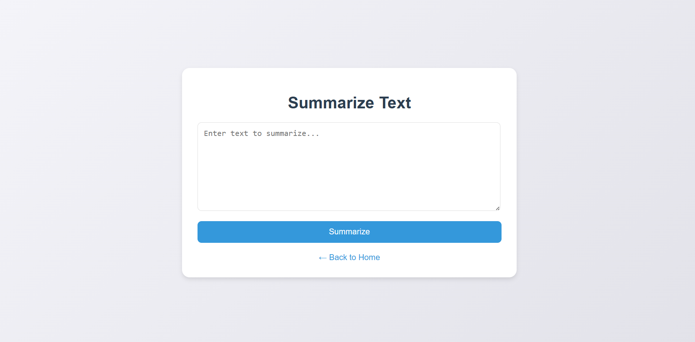
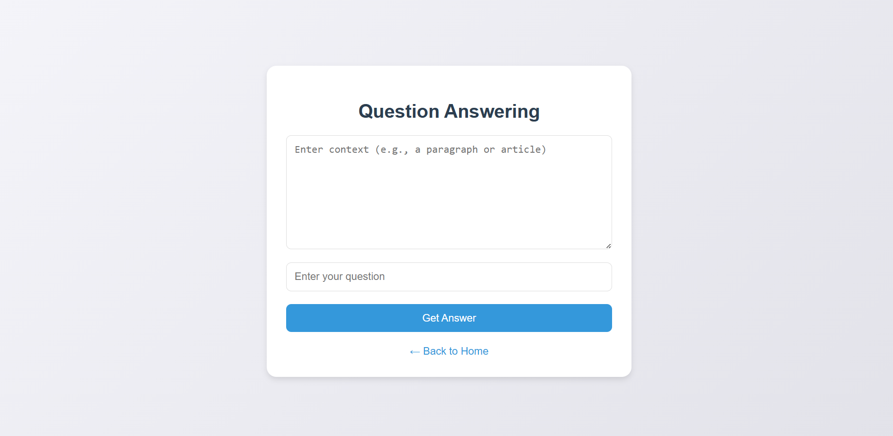
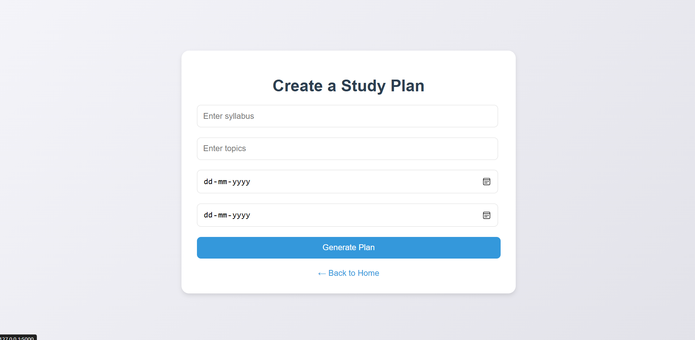

# 🧠 AI Study Assistant - Flask Web Application


🚀 **AI Study Assistant** is a Flask-based web application that integrates multiple NLP models for **question generation, text summarization, question answering, and study plan generation**. It utilizes cutting-edge AI models to assist students in streamlining their learning process.  

---

## 🌟 Features

- 🔹 **Question Generator** - Generate relevant questions from any paragraph.
- 🔹 **Text Summarization** - Summarize long texts effectively.
- 🔹 **Question Answering** - Get precise answers based on provided context.
- 🔹 **Study Plan Generator** - Create structured study plans tailored to your needs.

---

## 🛠️ Technologies Used

| **Technology**  | **Usage**  |
|----------------|-----------|
| **Flask** | Web framework for building APIs |
| **Transformers (Hugging Face)** | NLP models for text processing |
| **Google Gemini AI** | Study plan generation |
| **Textwrap** | Handling large text input |

### **AI/ML Models Used**
- 🤖 **Question Generation:** `valhalla/t5-base-qg-hl`
- 📚 **Text Summarization:** `facebook/bart-large-cnn`
- ❓ **Question Answering:** `distilbert-base-uncased-distilled-squad`
- 🗓 **Study Plan Generator:** `gemini-pro` (Google AI)

---

## 🎨 System Architecture

The application follows a **client-server** architecture where the frontend interacts with the backend via Flask routes. The backend processes requests using NLP models and returns results dynamically.

---

## 📂 Project Structure

```
📦 AI-Study-Assistant-Flask
├── 📁 templates/         # HTML templates
├── 📁 static/            # CSS & JavaScript files
├── 📝 app.py             # Main Flask application
├── 📝 config.py          # API key configuration
├── 📝 requirements.txt   # Dependencies list
└── 📝 README.md          # Project documentation
```

---

## 🔧 Setup & Installation

### 1️⃣ **Clone the Repository**
```bash
git clone https://github.com/yourusername/AI-Study-Assistant-Flask.git
cd AI-Study-Assistant-Flask
```

### 2️⃣ **Create a Virtual Environment**
```bash
python -m venv venv
source venv/bin/activate  # On Windows: venv\Scripts\activate
```

### 3️⃣ **Install Dependencies**
```bash
pip install -r requirements.txt
```

### 4️⃣ **Set Up API Keys**
- Get an API key from **Google Gemini AI**.
- Add it to `config.py`:
```python
import google.generativeai as genai
GEMINI_API_KEY = "your-api-key-here"
genai.configure(api_key=GEMINI_API_KEY)
```

### 5️⃣ **Run the Flask App**
```bash
python app.py
```
📌 Open **http://127.0.0.1:5000/** in your browser.

---

## 🚀 Usage Guide

### 📝 **Question Generator**
1. Enter a paragraph.
2. Click **Generate Questions**.
3. Get AI-generated questions.

### 💑 **Text Summarization**
1. Paste long text.
2. Click **Summarize**.
3. Receive a concise summary.

### ❓ **Question Answering**
1. Provide a context & question.
2. Click **Get Answer**.
3. AI extracts the best answer.

### 🔖 **Study Plan Generator**
1. Enter subjects & deadlines.
2. Click **Generate Plan**.
3. Receive a structured study schedule.

---

## 🖼️ Screenshots

🔹 **Home Page**  


🔹 **Question Generator**  


🔹 **Summariezer Context** 


🔹 **Question Answering** 


🔹 **Study Plan Generator** 


---

## 🏰 Future Enhancements
✅ **Voice-based interactions**  
✅ **Integration with GPT-4 for better accuracy**  
✅ **Deploying as a cloud-based SaaS application**  

---

## 🤝 Contributing

💡 Contributions are welcome! If you'd like to improve this project, feel free to fork the repo, create a new branch, and submit a pull request.

1. Fork the repository.
2. Create a new branch: `git checkout -b feature-branch`
3. Commit changes: `git commit -m "Added new feature"`
4. Push to the branch: `git push origin feature-branch`
5. Open a Pull Request.

---

## ⚖️ License
This project is licensed under the **MIT License**. Feel free to use and modify it.

---

## 📞 Contact
For queries or collaborations, reach out:

📧 Email: `jiteshshelke09@gmail.com`  
🔗 LinkedIn: (https://www.linkedin.com/in/jitesh-shelke-702745286/)  
🌎 GitHub:(https://github.com/JiteshShelke)  

---

🌟 **If you like this project, don't forget to give it a star!** ⭐
